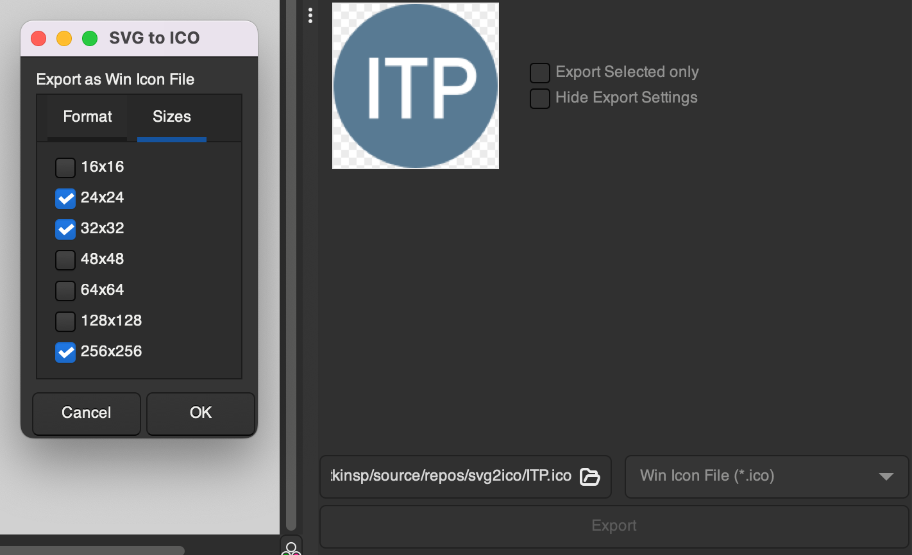

# svg2ico

Inkscape extension to save image to a [Microsoft Windows ICO file](https://en.wikipedia.org/wiki/ICO_(file_format)).

## How to install

Extract files from the archive and [copy them into the Inkscape extensions folder](https://inkscape.org/learn/faq/#how-install-new-extensions-palettes-document-templates-symbol-sets-icon-sets-etc).

## Usage

1. Choose `File->Export...`
2. Choose `Win Icon File (*.ico)` from the export format dropdown
3. Click the `Export` button
4. In the Export Settings Dialog, choose the sizes you want to embed in the ICO file from the `Sizes` tab and click `OK`. Under the `Format` tab you may also choose either `PNG` (default) or `BMP` for the format of the embedded images.

## About
The `svg2ico` Inkscape extension (version 0.2) was originally  written by [Maurizio Aru](https://github.com/ginopc) for versions of Inkscape prior to 1.0. Inkscape changed its internal Python interpreter from Python 2 to Python 3. With that change, the PIL library was replaced with [Pillow](https://pillow.readthedocs.io/en/stable/index.html). Pillow supports most of what PIL could do, but doesn't support reading SVG files. [Peter Watkins](https://github.com/watkipet) converted the extension (version 1.0.0) to use Inkscape's [inkex library](https://inkscape.gitlab.io/extensions/documentation/index.html).

### Authors
* [Peter Watkins](https://github.com/watkipet)
* [Maurizio Aru](https://github.com/ginopc)

